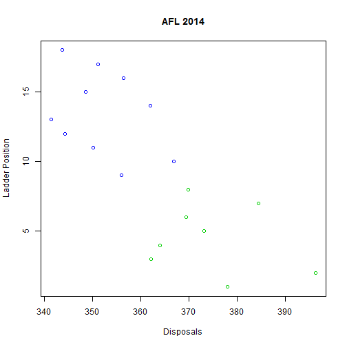

## Australian Rules Football (AFL)
* Australian Field Sport
* Popular in the south-East States
* Kick the ball through the goals to win

--- .class #id 

## Measures of Performance

Some Teams are much better than others
* Hawthorn are great!
* Melbourne, not so much

Let's look at some variables to include in our prediction function

--- .class #id

Kicking the ball through the middle posts

 

--- .class #id

Successfully passing the ball

 

